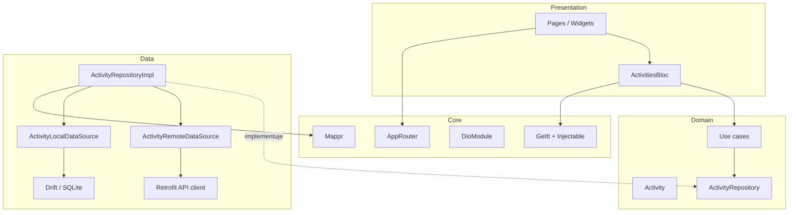
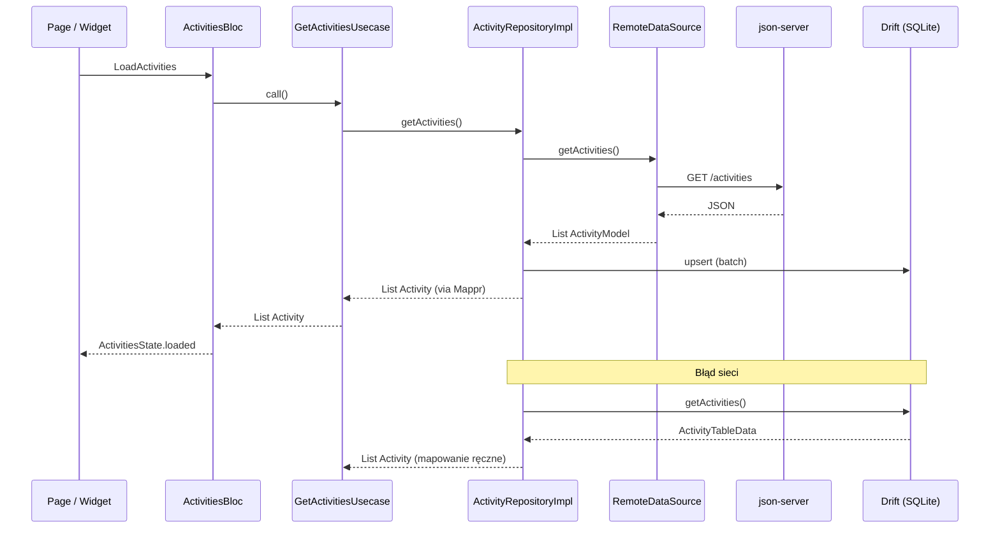
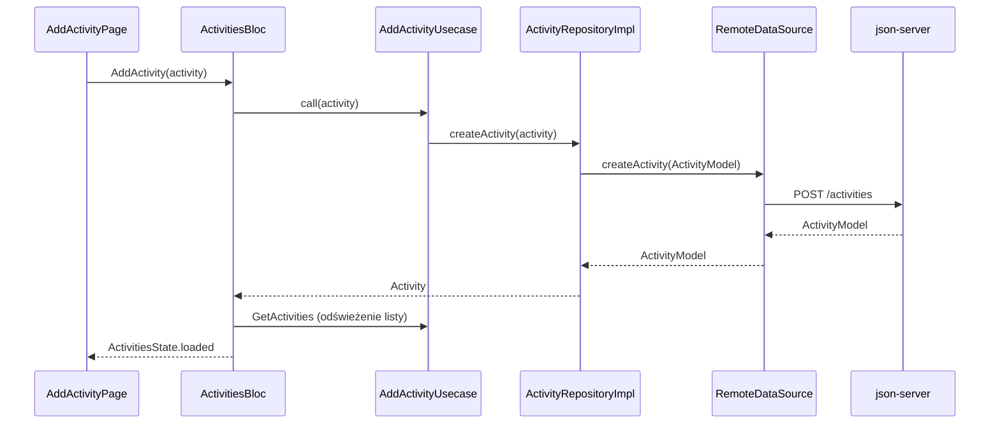

# SportSpot 🏃

Aplikacja do organizowania lokalnych aktywności sportowych. Pozwala przeglądać aktywności na mapie, dołączać do nich oraz dodawać własne.

## Stack

| Obszar | Technologia |
|--------|-------------|
| Framework | Flutter 3.41.9 (FVM) |
| State management | BLoC |
| DI | GetIt + Injectable |
| Nawigacja | auto_route |
| Baza lokalna | Drift (SQLite) |
| Sieć | Retrofit + Dio |
| Modele | Freezed + json_serializable |
| Mapowanie | auto_mappr |
| Mapa | flutter_map (OpenStreetMap) |
| Testy | bloc_test, mocktail, mockito |
| CI/CD | GitHub Actions |

## Architektura

Projekt stosuje **Clean Architecture** z podziałem na warstwy w obrębie feature’ów (`features/<nazwa>/`). Zależności idą **tylko do wewnątrz**: presentation → domain ← data.



### Struktura katalogów

```
lib/
├── core/
│   ├── di/           # GetIt, Injectable, Mappr
│   ├── network/      # Dio (base URL, interceptory)
│   └── router/       # auto_route — trasy aplikacji
└── features/
    └── activities/
        ├── domain/
        │   ├── entities/       # Activity — czysty model biznesowy
        │   ├── repositories/   # kontrakt ActivityRepository
        │   └── usecases/       # GetActivities, AddActivity, JoinActivity
        ├── data/
        │   ├── models/         # ActivityModel (JSON), ActivityTable (Drift)
        │   ├── datasources/
        │   │   ├── remote/     # Retrofit + ActivityRemoteDataSource
        │   │   └── local/      # Drift + ActivityLocalDataSource
        │   └── repositories/   # ActivityRepositoryImpl
        └── presentation/
            ├── bloc/           # ActivitiesBloc, Event, State
            └── pages/          # mapa, lista, szczegóły, dodawanie
```

### Odpowiedzialność warstw

| Warstwa | Zna | Nie zna |
|---------|-----|---------|
| **Domain** | encje, reguły biznesowe, interfejs repozytorium | Flutter, Dio, Drift, JSON |
| **Data** | API, SQLite, mapowanie Model ↔ Entity | Widgety, BLoC |
| **Presentation** | UI, stany BLoC, wywołania use case’ów | szczegóły HTTP/SQL |

### Nawigacja

`MainPage` hostuje zakładki (mapa + lista) przez `AutoTabsScaffold`. Osobne trasy: dodawanie aktywności, szczegóły.

## Przepływ danych

### Odczyt listy aktywności (offline-first)

Repozytorium najpierw próbuje sieci. Po sukcesie **cache’uje** odpowiedź w SQLite. Przy błędzie sieci zwraca dane z lokalnej bazy.



**Mapowanie przy odczycie:**

| Źródło | Typ pośredni | Encja domenowa |
|--------|--------------|----------------|
| API | `ActivityModel` | `Activity` (auto_mappr) |
| SQLite (fallback) | `ActivityTableData` | `Activity` (konstruktor) |

### Zapis nowej aktywności



### Inicjalizacja aplikacji

```
main()
  → configureDependencies()   # GetIt + Injectable
  → SportSpotApp
      → BlocProvider(ActivitiesBloc)
      → MaterialApp.router(AppRouter)
      → ActivitiesEvent.loadActivities()
```

## Uruchomienie

1. Zainstaluj FVM: `dart pub global activate fvm`
2. `fvm use stable`
3. `fvm flutter pub get`
4. Uruchom fake API: `json-server db.json`
5. `fvm flutter run`

## Testy

```bash
fvm flutter test
```

Struktura testów odzwierciedla warstwy: use case’y (domain), repozytorium (data), BLoC (presentation).
